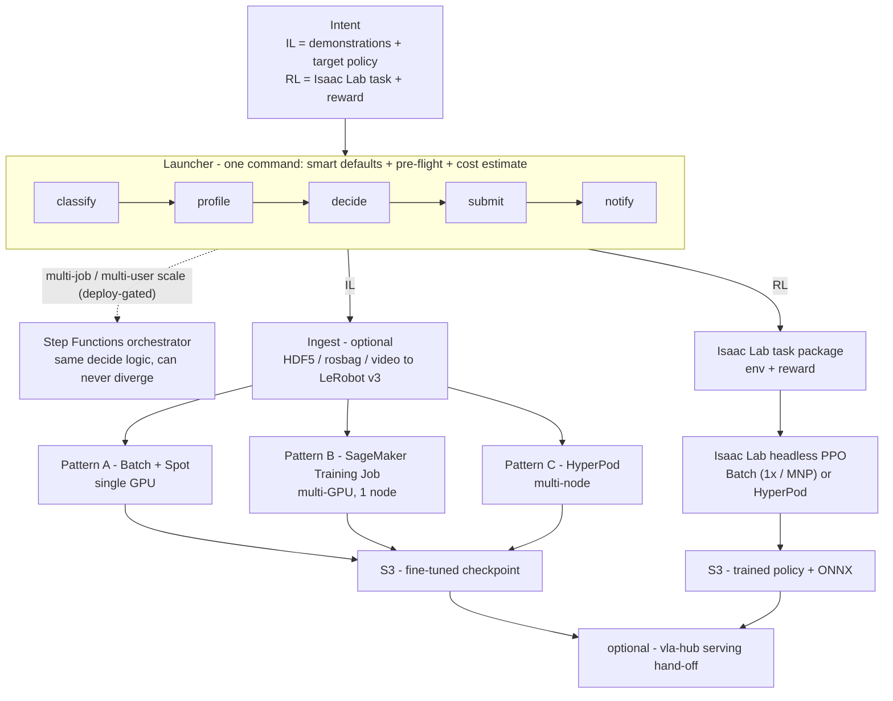

# vla-ft — AWS 위에서 VLA Fine-Tuning (Imitation + Reinforcement)

> 이 문서는 [`README.md`](README.md)의 국문판입니다. 기술 용어는 원어 그대로 둡니다.

Vision-Language-Action(VLA) 정책을 AWS에서 단일 명령으로 fine-tune 합니다. 사용자는
*intent* 만 가져오면 됩니다 — imitation-learning 시연 데이터, 또는 reward가 있는
reinforcement-learning task. `vla-ft`가 GPU 인스턴스를 고르고, job 크기를 산정하고,
맞는 가장 저렴한 capacity에서 실행한 뒤 학습된 정책을 돌려줍니다. 사용자가 직접 launcher를
작성하거나 backend를 손으로 고를 일이 없습니다.

**좋은 결과를 얻기 위해 AWS를 — 또는 VLA fine-tuning best practice를 — 알 필요가
없습니다.** VLA fine-tuning에 대한 AWS 권장 결정(어떤 job 크기에 어떤 service, Spot
경제성, capacity probing, 언제 early-stop, Spot 회수에서 어떻게 복구)이 플랫폼에 인코딩돼
있습니다. 사용자는 dataset+model 또는 task를 주고, 플랫폼이 그 결정을 대신 적용한 뒤 job이
끝나면 인프라를 다시 내립니다 — 그래서 남아 도는 GPU도, 기억해야 할 cleanup도 없습니다.

> **상태 요약.** Imitation-learning(IL) 경로는 구현 완료이며, Pattern A(AWS Batch)는
> 실제 데이터셋으로 end-to-end 검증되었습니다. Reinforcement-learning(RL) 경로는 코드는
> 완성됐으나 아직 GPU에서 실행하지 않았습니다. [상태](#상태) 섹션에 컴포넌트별 정직한
> 내역이 있습니다 — 이 문서는 구현된 것 이상으로 과장하지 않습니다.

## 아키텍처 한눈에

intent 하나가 들어가면 launcher가 분류하고, job 크기를 산정하고, 맞는 가장 저렴한 backend를
고르고, submit하고, 알림을 보낸 뒤 — S3에 산출물을 돌려줍니다. 동일한 결정 로직은
multi-job/multi-user 규모가 정당화될 때만 Step Functions orchestrator로 승격됩니다(배포
gate). 전체 설계: [`docs/ARCHITECTURE.md`](docs/ARCHITECTURE.md).



## 왜 여기서 실행하나 — Well-Architected 관점

`vla-ft`의 핵심은, VLA를 fine-tune 하는 AWS 권장 방식이 직접 조립해야 하는 것이 아니라
*기본값*이라는 점입니다.
[AWS Well-Architected Framework](https://aws.amazon.com/architecture/well-architected/)
pillar에 매핑하면:

- **Cost Optimization** — Spot이 기본으로 켜져 있고, 인스턴스는 job에 맞게 auto-size(과다
  프로비저닝 없음)되며, early-stop이 step을 태우는 대신 best checkpoint를 출고하고,
  **실행 전에 비용 추정치**를 봅니다. 결정적으로 **job이 스스로 scale-down** 합니다: Batch는
  인스턴스를 0으로 되돌리고 SageMaker Training Job은 ephemeral이라, idle GPU 과금이 없고
  끄는 걸 기억할 필요도 없습니다. 검증된 IL run은 규모에 따라 **~$4–$26** 수준입니다.
- **Operational Excellence** — 플랫폼 전체가 **CDK IaC**. 모든 backend·role·queue·bucket이
  리뷰·diff·버전·재배포 가능한 코드 — 콘솔 click-ops 없음, account/region 간 재현 가능.
  backend 결정은 **하나의 auditable 모듈**(`vla_ft_decide`)에 있으며 launcher와
  orchestrator가 공유하므로 절대 어긋나지 않고, 완료/실패 시 SNS로 알립니다.
- **Reliability** — checkpoint + resume이 Spot 회수를 run 손실 없이 복구하고,
  **AZ-capacity probe**(`AzSelector`)가 submit 전에 실제로 GPU가 있는 AZ를 골라
  insufficient-capacity stall을 피합니다.
- **Performance Efficiency** — job이 규모에 맞는 backend·인스턴스에 매칭됩니다(짧은 job은
  single-GPU Batch, 긴 job은 multi-GPU SageMaker, 진짜 multi-node일 때만 HyperPod) — 그래서
  under-size도 oversized cluster 비용도 없습니다.
- **Security** — stack별 least-privilege IAM, S3 access logging, ECR 이미지 암호화(KMS),
  GPU launch template의 IMDSv2 강제(pre-publish hardening).

> 정직한 범위: Pattern A(Batch)가 end-to-end 검증된 경로이고, B/C는 코드 완성이지만 아직
> 배포 검증 안 됨, RL 경로는 아직 GPU에서 실행 안 됨([정직한 한계](#정직한-한계) 참고).
> HyperPod는 scale-to-zero의 유일한 예외 — persistent cluster를 보유하므로, 바로 그래서
> 플랫폼이 가장 큰 multi-node job에만 배정합니다.

## Quickstart

Launcher(`containers/vla-ft/vla_ft_cli.py`)가 backend + 인스턴스를 고르고, 배포된 stack
연결 정보를 해석하고, pre-flight 점검을 돌리고, 비용 추정치를 출력한 뒤, 검증된 launcher를
대신 호출합니다. 사용자는 데이터셋 + 모델(IL) 또는 task(RL)만 가져오면 되고, **하나의
명령이 두 경로를 모두 처리**합니다.

```bash
# launcher venv 에서 (boto3 + sagemaker 설치됨)
cd containers/vla-ft

# 0. 계획 + 비용 추정만 보고, 아무것도 실행하지 않음 (--yes 없으면 기본값)
python vla_ft_cli.py --dataset s3://.../lerobot_dataset/ --model pi05 --dry-run

# 1. 번들된 OpenArm-lift 데이터셋으로 단일 명령 end-to-end (IL)
python vla_ft_cli.py --quickstart --yes

# 2. RL: task id 로부터 sim 정책 학습 (Isaac Lab headless PPO on Batch)
python vla_ft_cli.py --intent rl --task Isaac-Velocity-Rough-H1-v0 \
    --max-iterations 3000 --num-envs 4096 --dry-run
```

해석된 계획 예시 (`--quickstart --dry-run`):

```
vla-ft plan — pi05 (3.3B), expert_only
  decision   : Pattern B (sagemaker)  on  g6e.12xlarge  [ml.g6e.12xlarge]
  why        : per-GPU ~23 GB ≤ 48 GB but est ~5.6 h (>4 h, wants auto-resume) → Pattern B
  compute    : 4 GPU × per-device batch 4 (eff batch 16), Spot
  est cost   : ~$26  (Spot @ $4.59/hr)   ·  On-Demand ~$73
pre-flight:
  [ok]   HF token OK (SSM /pai/hf-token @ us-east-1)
  [info] capacity: g6e.12xlarge SPS in us-west-2
```

`--quickstart`가 자동으로 해석하는 항목 (전부 override 가능):

| 단계 | Smart default | Override |
|------|---------------|----------|
| dataset | 번들된 OpenArm-lift (50 ep, LeRobot v3) | `--dataset s3://…` |
| model | `pi05` | `--model groot\|act\|smolvla\|…` |
| fine-tune mode | **expert-only** (pi 계열: 2B VLM freeze, L40S 1장에 적재, overfit 저항) | `--full-vlm` · `--lora` (QLoRA n/a — lerobot에 4-bit 경로 없음) |
| backend + 인스턴스 | rule table → Pattern A/B/C + 인스턴스 (예: pi05 / 20k steps → **B** on g6e.12xlarge) | `--backend` · `--instance-type` |
| capacity | Spot **on** | `--no-spot` |
| HF token | SSM `/pai/hf-token` (gated PaliGemma) | `--hf-token-ssm` · `--no-hf-token` |
| overfit guard | off | `--select-best` (val episode 5개를 hold out, best checkpoint 출고) |

> **사전 조건:** IL stack을 먼저 배포하세요
> (`cdk deploy PaiTrainingPlatform-IL-PatternA` / `-PatternB`). CLI는 어떤 값도
> 하드코딩하지 않고 해당 stack의 CloudFormation Outputs(role / image / queue / output
> bucket)를 읽습니다.

## 무엇을 주고, 무엇을 받는가

| 경로 | 사용자가 제공 | 결과물 |
|------|---------------|--------|
| **IL** (supervised fine-tune) | 시연 데이터 (video / HDF5 / teleop rosbag / 기존 LeRobot v3 dataset) + target 정책 (π0.5, GR00T, ACT, …) | fine-tune된 VLA checkpoint |
| **RL** (sim 정책 학습) | Isaac Lab task + reward / success 기준 + target 로봇 | 학습된 RL 정책 (PPO, …) + ONNX export |

두 경로 모두 중요한 이유:

- **IL이 항상 가능한 것은 아니다.** 순수 시뮬레이션 환경에서는 사람의 시연을 아예 수집할
  수 없는 경우가 많습니다 — 이때는 reward에 대해 **RL**로 정책을 학습합니다. RL은 부가
  기능이 아니라 1급 입력입니다.
- **시연 파이프라인은 얇다.** 원시 imitation video를 LeRobot dataset으로 바꾸는 데에는
  아직 빠진 고리(video → action label)가 있습니다. `vla-ft`는 이 단계를 위한 pluggable
  ingest stage를 제공하며, 아직 구현되지 않은 부분에 대해 정직하게 표기합니다.

## Backend

같은 intent를 세 가지 backend에서 실행할 수 있습니다. Launcher가 기본값을 고르며,
override 할 수 있습니다.

| Pattern | Backend | 적합한 경우 | Trade-off | 상태 |
|---------|---------|-------------|-----------|------|
| **A** | AWS Batch + EC2 Spot (single GPU, 예: g6e.4xlarge) | 작고 짧은 job, single-GPU 적재, 저렴한 PoC | single-GPU 한계 — 큰 모델·multi-GPU는 안 맞음; Spot 회수 시 managed resume 없이 checkpoint+retry에 의존 | end-to-end 검증 완료 |
| **B** | SageMaker Training Job + Managed Spot (multi-GPU, single node) | 중간 규모 job, 8h+, auto-resume 필요 | raw Batch 대비 SageMaker overhead; 여전히 single-node 한계 | 코드 완성; 실제 배포 대기 (검증된 컨테이너 재사용) |
| **C** | SageMaker HyperPod (multi-node, EFA + FSx) | 대규모 multi-node, 수일 | 가장 높은 setup 비용 — cluster를 직접 보유; 가장 큰 job에서만 본전 | 코드 + `cdk synth`; 실제 배포 보류 |

### Backend가 선택되는 방식

선택은 **smart default** 입니다: `vla_ft_decide.py`가 데이터 규모, 모델 VRAM, sim env
개수, 예산을 읽어 Pattern A/B/C + 인스턴스를 고릅니다. AWS 호출이 없는 순수 stdlib-only
모듈이므로 오프라인으로 테스트할 수 있습니다 (`python test_vla_ft_decide.py`).

multi-job / multi-user 규모를 위해, 같은 결정 로직이 선택적 Step Functions
orchestrator(`lib/orchestrator/`, 코드 + synth로 구현, 배포 gate)에도 연결돼 있습니다.
Launcher와 orchestrator가 **동일한** `vla_ft_decide` 모듈을 import 하므로, 두 경로 사이에서
backend 선택이 달라질 수 없습니다.

## 저장소 구조

```
pai-training-platform/          (product: vla-ft)
├── bin/app.ts                 CDK entry — shared + 패턴별 stack 구성
├── lib/
│   ├── shared/                VPC · AzSelector (GPU capacity probe) · EFS · ECR · S3 · IAM · notifications
│   ├── il/                    Pattern A (Batch) · B (SM Training Job) · C (HyperPod)
│   ├── rl/                    Isaac Lab headless PPO on Batch · C (HyperPod) [사전 구현]
│   ├── ingest/                upload-event → LeRobot v3 converter (HDF5 / rosbag / video adapter)
│   └── orchestrator/          선택적 Step Functions + Lambda 결정 엔진 [코드 + synth, 배포 gate]
├── containers/
│   ├── vla-ft/                검증된 LeRobot VLA FT 컨테이너 (IL 엔진);
│   │                            vla_ft_decide / cli + orchestrator plan/submit Lambda 도 포함
│   └── isaac-lab-rl/          Isaac Lab RL 컨테이너 (rsl_rl 통한 headless PPO)
├── mcp/                       선택적 MCP server — agent session에서 submit / monitor / read-back
└── docs/                      ARCHITECTURE.md · ROADMAP.md · MCP-DESIGN.md
```

## 상태

- **IL 경로: A/B/C 전부 구현.** Pattern A는 end-to-end 검증 완료 (Batch Spot: dataset
  입력 → checkpoint 출력). Pattern B는 코드 완성 (검증된 컨테이너를 감싼 SM Training Job),
  실제 배포 대기. Pattern C는 코드 + `cdk synth` (HyperPod multi-node 배포 보류).
  Early-stop, expert-only, SNS notification 구현됨.
- **Launcher UX: 구현, dry-run 검증.** `vla_ft_cli.py` + `vla_ft_decide.py`가 lever
  (AzSelector, Spot, early-stop, expert-only)를 pre-flight 점검 + 사전 비용 추정(실제
  us-west-2 가격 기준)이 있는 단일 명령 smart-default launcher로 묶습니다.
  `test_vla_ft_decide.py`(98개 점검)와 live CloudFormation Outputs 대상 실제 dry-run이
  통과합니다; live `--yes` submit이 남은 점검 항목입니다.
- **RL 경로: 최대 gap.** Isaac Lab headless PPO는 코드로 구현돼 synth + jest를
  통과하지만, 아직 어떤 RL job도 GPU에서 실행되지 않았습니다. 실제 실행이 정책 + ONNX를
  내놓기 전까지 RL coverage는 *구현됨, 아직 전달 안 됨*으로 간주하세요.

검증된 것 vs 설계만 된 것의 단계별 내역은 [`docs/ROADMAP.md`](docs/ROADMAP.md) 참고.

## 비교

`vla-ft`는 "또 하나의 training pipeline"이 아닙니다. 기존 AWS robot-learning 자산들이 함께
묶지 않은 네 가지를 결합합니다:

- **Ease** — 단일 명령, smart default, pre-flight 점검; 손으로 쓰는 launcher 없음.
- **Efficiency** — Spot + AZ 선택 + 인스턴스 auto-sizing + early-stop을 기본값으로,
  실행 *전에* 비용 추정 제공.
- **Coverage** — IL *과* RL을 하나의 진입점 뒤에.
- **Backend 유연성** — 같은 intent를 Batch, SageMaker Training Job, HyperPod(A/B/C)에서
  실행, override 가능.

[`docs/ARCHITECTURE.md` §6](docs/ARCHITECTURE.md)에 정직한 prior-art 비교가 있습니다 —
기존 AWS sample과 겹치는 지점과 실제로 차별화되는 지점을 모두 포함합니다.

### 언제 맞고 — 언제 과한가

| `vla-ft`를 쓸 때 | 건너뛸 때 (과함) |
|---|---|
| 정책을 **둘 이상** fine-tune 하거나, IL과 RL을 오갈 때 | **모델 하나·backend 하나**만 영원히 학습 — 손으로 쓴 launcher 하나가 더 간단 |
| 매 run마다 손 튜닝 **없이** Spot/인스턴스/early-stop 경제성을 원할 때 | 이미 신뢰하는 튜닝·고정된 pipeline이 있고 새 abstraction을 원치 않을 때 |
| job 규모가 변하고(오늘 PoC, 다음 분기 multi-node) 매번 launcher를 다시 쓰기 싫을 때 | 모든 job이 같은 규모 — 고정된 Batch/SageMaker job으로 충분 |
| smart-default + 비용 미리보기 UX가 시간을 아낄 만큼 job을 충분히 돌릴 때 | setup 비용이 편의를 넘어서는 일회성 실험 |

### 정직한 한계

이 문서는 과장하지 않습니다. 동일한 caveat이
[`docs/ARCHITECTURE.md` §6](docs/ARCHITECTURE.md)에도 기록돼 있습니다:

- **RL은 구현됨, 아직 전달 안 됨.** Isaac Lab headless-PPO 경로는 synth + jest를
  통과하지만, 이 계정에서 **아직 어떤 RL job도 GPU에서 실행되지 않았습니다.** 실제 실행이
  정책 + ONNX를 내놓기 전까지 Coverage 주장은 *구현됨, 아직 전달 안 됨* 입니다.
- **단일 명령 경로는 dry-run 검증, `--yes` 검증은 아직.** Launcher·결정 모듈·비용 추정은
  `test_vla_ft_decide.py`와 실제 CloudFormation Outputs 대상 live dry-run을 통과하지만,
  live `--yes` submit이 남은 점검입니다. 비용 추정은 per-job profiler가 아니라 검증된
  실행을 기준으로 anchor 합니다.
- **Pattern B/C는 배포 검증 안 됨.** B는 코드 완성(검증된 A 컨테이너 재사용); C는 코드 +
  `cdk synth`만 — 실제 HyperPod multi-node 배포는 보류.
- **Ingest에 알려진 gap.** raw video → action label은 pluggable adapter slot으로
  노출되지만 **미구현**; HDF5와 LeRobot v3 입력은 준비됨, rosbag은 pattern.
- **Pattern A는 기존 AWS sample과 겹칩니다**(특히 VAMS도 Isaac Lab RL을 Batch에서 실행).
  여기서의 가치는 standalone 신규성이 아니라 smart-default launcher 뒤의 선택 가능한 backend
  하나라는 점입니다 — [`docs/ARCHITECTURE.md` §6](docs/ARCHITECTURE.md) 참고.

## 설계 문서

- [`docs/ARCHITECTURE.md`](docs/ARCHITECTURE.md) — 전체 설계: 4축 positioning, 두 경로
  (IL / RL), 세 backend, 선택적 orchestrator, ingest, 자산 재사용 맵, prior-art 차별화,
  핵심 결정.
- [`docs/ROADMAP.md`](docs/ROADMAP.md) — 단계별 빌드 계획과 단계별 검증 수준.
- [`docs/MCP-DESIGN.md`](docs/MCP-DESIGN.md) — 선택적 MCP server 설계.

## 네이밍

제품명은 **`vla-ft`** 입니다. 저장소 디렉터리(`pai-training-platform/`), CDK stack 이름
(`PaiTrainingPlatform-*`), ECR repo(`pai/vla-ft`), job prefix(`vla-ft-`)는 기존 식별자를
유지합니다.

## Security

자세한 내용은 [CONTRIBUTING](CONTRIBUTING.md#security-issue-notifications) 참고.

## License

이 라이브러리는 MIT-0 License로 배포됩니다. [LICENSE](LICENSE) 파일 참고.
