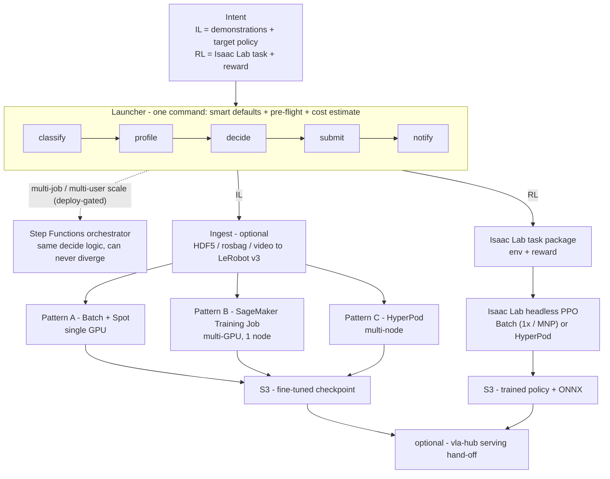

# vla-ft — VLA Fine-Tuning on AWS (Imitation + Reinforcement)

> 한국어 문서는 [`README.ko.md`](README.ko.md) 참고.

Fine-tune a Vision-Language-Action (VLA) policy on AWS from a single command. You bring an
*intent* — imitation-learning demonstrations, or a reinforcement-learning task with a
reward — and `vla-ft` picks the GPU instance, sizes the job, runs it on the cheapest
capacity that fits, and hands back a trained policy. You never hand-write a launcher or
pick a backend by hand.

**You do not need to know AWS — or the VLA fine-tuning best practice — to get a good
result.** The AWS-recommended decisions for VLA fine-tuning (which service for which job
size, Spot economics, capacity probing, when to stop early, how to recover from a Spot
reclaim) are encoded in the platform. You give it a dataset+model or a task; it applies
those decisions for you and tears the infrastructure back down when the job is done — so
there is no GPU left running and no cleanup to remember.

> **Status at a glance.** The imitation-learning (IL) path is built, with Pattern A
> (AWS Batch) verified end-to-end on a real dataset. The reinforcement-learning (RL) path
> is code-complete but not yet run on a GPU. The [Status](#status) section gives the
> honest per-component breakdown — this README does not oversell what is built.

## Architecture at a glance

One intent goes in; the launcher classifies it, sizes the job, picks the cheapest backend
that fits, submits, and notifies — then hands back an artifact in S3. The same decision
logic graduates to a Step Functions orchestrator only when multi-job/multi-user scale
justifies it (deploy-gated). Full design: [`docs/ARCHITECTURE.md`](docs/ARCHITECTURE.md).



## Why run it here — the Well-Architected case

The point of `vla-ft` is that the AWS-recommended way to fine-tune a VLA is the *default*,
not something you have to assemble. Mapped to the
[AWS Well-Architected Framework](https://aws.amazon.com/architecture/well-architected/)
pillars:

- **Cost Optimization** — Spot is on by default, the instance is auto-sized to the job
  (no over-provisioning), early-stop ships the best checkpoint instead of burning steps,
  and you see a **cost estimate before you launch**. Crucially, **the job scales itself
  down**: Batch returns the instance to zero and a SageMaker Training Job is ephemeral, so
  there is no idle GPU billing and nothing to remember to turn off. A verified IL run lands
  around **~$4–$26** depending on size.
- **Operational Excellence** — the whole platform is **CDK IaC**. Every backend, role,
  queue, and bucket is code you can review, diff, version, and redeploy — no console
  click-ops, reproducible across accounts/regions. The backend decision lives in **one
  auditable module** (`vla_ft_decide`), shared by the launcher and the orchestrator so it
  can never drift, and SNS notifies you on completion/failure.
- **Reliability** — checkpoint + resume recovers a Spot reclaim instead of losing the run,
  and an **AZ-capacity probe** (`AzSelector`) picks an AZ that actually has the GPU before
  submitting, avoiding insufficient-capacity stalls.
- **Performance Efficiency** — the job is matched to the right backend and instance for its
  scale (single-GPU Batch for a short job, multi-GPU SageMaker for a longer one, HyperPod
  only when it's genuinely multi-node) — so you neither under-size nor pay for an oversized
  cluster.
- **Security** — least-privilege IAM per stack, S3 access logging, ECR image encryption
  (KMS), and IMDSv2 enforced on GPU launch templates (pre-publish hardening).

> Honest scope: Pattern A (Batch) is the verified end-to-end path; B/C are code-complete
> but not yet deploy-verified, and the RL path has not yet run on a GPU
> (see [Honest limitations](#honest-limitations)). HyperPod is the one exception to
> scale-to-zero — it holds a persistent cluster, which is exactly why the platform reserves
> it for the largest multi-node jobs.

## Quickstart

The launcher (`containers/vla-ft/vla_ft_cli.py`) picks the backend + instance, resolves
the deployed stack wiring, runs pre-flight checks, prints a cost estimate, and calls the
verified launcher for you. You bring a dataset + model (IL) or a task (RL) — the **same
one command does both**.

```bash
# from the launcher venv (boto3 + sagemaker installed)
cd containers/vla-ft

# 0. see the plan + cost estimate, launch NOTHING (the default without --yes)
python vla_ft_cli.py --dataset s3://.../lerobot_dataset/ --model pi05 --dry-run

# 1. one-command end-to-end on the bundled OpenArm-lift dataset (IL)
python vla_ft_cli.py --quickstart --yes

# 2. RL: a sim policy from a task id (Isaac Lab headless PPO on Batch)
python vla_ft_cli.py --intent rl --task Isaac-Velocity-Rough-H1-v0 \
    --max-iterations 3000 --num-envs 4096 --dry-run
```

Example resolved plan (`--quickstart --dry-run`):

```
vla-ft plan — pi05 (3.3B), expert_only
  decision   : Pattern B (sagemaker)  on  g6e.12xlarge  [ml.g6e.12xlarge]
  why        : per-GPU ~23 GB ≤ 48 GB but est ~5.6 h (>4 h, wants auto-resume) → Pattern B
  compute    : 4 GPU × per-device batch 4 (eff batch 16), Spot
  est cost   : ~$26  (Spot @ $4.59/hr)   ·  On-Demand ~$73
pre-flight:
  [ok]   HF token OK (SSM /pai/hf-token @ us-east-1)
  [info] capacity: g6e.12xlarge SPS in us-west-2
```

What `--quickstart` resolves automatically (all overridable):

| Step | Smart default | Override |
|------|---------------|----------|
| dataset | bundled OpenArm-lift (50 ep, LeRobot v3) | `--dataset s3://…` |
| model | `pi05` | `--model groot\|act\|smolvla\|…` |
| fine-tune mode | **expert-only** (pi-family: freeze the 2B VLM, fits one L40S, resists overfit) | `--full-vlm` · `--lora` (QLoRA n/a — lerobot has no 4-bit path) |
| backend + instance | rule table → Pattern A/B/C + instance (e.g. pi05 / 20k steps → **B** on g6e.12xlarge) | `--backend` · `--instance-type` |
| capacity | Spot **on** | `--no-spot` |
| HF token | SSM `/pai/hf-token` (gated PaliGemma) | `--hf-token-ssm` · `--no-hf-token` |
| overfit guard | off | `--select-best` (holds out 5 val episodes, ships the best checkpoint) |

> **Prereqs:** deploy the IL stacks first
> (`cdk deploy PaiTrainingPlatform-IL-PatternA` / `-PatternB`). The CLI reads their
> CloudFormation Outputs (role / image / queue / output bucket) rather than hardcoding
> anything.

## What you provide, what you get

| Path | You provide | You get |
|------|-------------|---------|
| **IL** (supervised fine-tune) | demonstration data (video / HDF5 / teleop rosbag / existing LeRobot v3 dataset) + a target policy (π0.5, GR00T, ACT, …) | a fine-tuned VLA checkpoint |
| **RL** (sim policy learning) | an Isaac Lab task + reward / success criteria + a target robot | a trained RL policy (PPO, …) + ONNX export |

Both paths matter:

- **IL is not always possible.** In a pure-simulation setting you often cannot collect
  human demonstrations at all — you learn the policy by **RL** against a reward. RL is a
  first-class input, not an afterthought.
- **Demonstration pipelines are thin.** Turning raw imitation video into a LeRobot dataset
  still has a missing link (video → action labels). `vla-ft` exposes a pluggable ingest
  stage for this and is honest about the part that is not built yet.

## Backends

The same intent can run on three backends. The launcher picks one by default; you can
override it.

| Pattern | Backend | Best for | Trade-off | Status |
|---------|---------|----------|-----------|--------|
| **A** | AWS Batch + EC2 Spot (single GPU, e.g. g6e.4xlarge) | small / short jobs, single-GPU fit, cheap PoC | single-GPU ceiling — won't fit large models or multi-GPU; relies on checkpoint+retry for Spot reclaim (no managed resume) | verified end-to-end |
| **B** | SageMaker Training Job + Managed Spot (multi-GPU, single node) | medium jobs, 8h+, needs auto-resume | SageMaker overhead vs raw Batch; still a single-node ceiling | code complete; real deploy pending (reuses the verified container) |
| **C** | SageMaker HyperPod (multi-node, EFA + FSx) | large multi-node, days | highest setup cost — you hold a cluster; only pays off for the largest jobs | code + `cdk synth`; real deploy deferred |

### How the backend is chosen

The pick is a **smart default**: `vla_ft_decide.py` reads data scale, model VRAM, sim env
count, and budget, then chooses Pattern A/B/C + instance. It is a pure, stdlib-only module
with no AWS calls, so you can test it offline (`python test_vla_ft_decide.py`).

For multi-job / multi-user scale, the same decision logic is also wired into an optional
Step Functions orchestrator (`lib/orchestrator/`, built as code + synth, deploy-gated).
The launcher and the orchestrator import the **same** `vla_ft_decide` module, so the
backend pick can never diverge between the two paths.

### Spot reclaim: resume, not restart

This is the concrete reason to reach for `vla-ft` over a self-managed
Slurm/ParallelCluster cluster you already run: **you do not hand-write the requeue/resume
launcher.** Spot is on by default, and a reclaim is recovered automatically, but the
*mechanism differs by backend* and the *maturity differs too* — stated honestly:

- **Pattern A (Batch)** — the container checkpoints to **EFS**; on a Spot reclaim Batch
  retries the job and the launcher resumes from the latest checkpoint on EFS rather than
  step 0. This path is **wired and a real run finished SUCCEEDED**; the mid-run
  reclaim→resume *transition itself* was not separately forced (the verified run completed
  before a reclaim), so treat the resume path as wired, not reclaim-proven.
- **Pattern B (SageMaker)** — uses SageMaker **Managed Spot Training**, where checkpoint
  upload/restore is native to the service. This is **code-complete but not yet
  deploy-verified** inside `vla-ft`.

Either way the platform owns the resume wiring. On a self-managed Slurm/ParallelCluster
cluster, Spot interruption handling, requeue, and checkpoint-restore are **yours to build
and maintain** — that DIY launcher is exactly what this removes. (Checkpointing itself is
always the training script's job — saving to S3/EFS/FSx — on any backend; what `vla-ft`
adds is the *resume-on-reclaim wiring* around it.)

## Repository layout

```
pai-training-platform/          (product: vla-ft)
├── bin/app.ts                 CDK entry — composes shared + per-pattern stacks
├── lib/
│   ├── shared/                VPC · AzSelector (GPU capacity probe) · EFS · ECR · S3 · IAM · notifications
│   ├── il/                    Pattern A (Batch) · B (SM Training Job) · C (HyperPod)
│   ├── rl/                    Isaac Lab headless PPO on Batch · C (HyperPod) [pre-built]
│   ├── ingest/                upload-event → LeRobot v3 converter (HDF5 / rosbag / video adapters)
│   └── orchestrator/          optional Step Functions + Lambda decision engine [code + synth, deploy-gated]
├── containers/
│   ├── vla-ft/                the verified LeRobot VLA FT container (the IL engine);
│   │                            also holds vla_ft_decide / cli + orchestrator plan/submit Lambdas
│   └── isaac-lab-rl/          Isaac Lab RL container (headless PPO via rsl_rl)
├── mcp/                       optional MCP server (built, 7 tools) — submit / monitor / checkpoint-verify from an agent session
└── docs/                      ARCHITECTURE.md · ROADMAP.md · MCP-DESIGN.md
```

## Status

- **IL path: A/B/C all built.** Pattern A verified end-to-end (Batch Spot: dataset in →
  checkpoint out). Pattern B code complete (SM Training Job wrapping the verified
  container), real deploy pending. Pattern C code + `cdk synth` (HyperPod multi-node deploy
  deferred). Early-stop, expert-only, and SNS notifications are built.
- **Launcher UX: built, dry-run validated.** `vla_ft_cli.py` + `vla_ft_decide.py` turn the
  levers (AzSelector, Spot, early-stop, expert-only) into a one-command smart-default
  launcher with pre-flight checks and a pre-launch cost estimate (real us-west-2 price
  anchors). `test_vla_ft_decide.py` (98 checks) and a real dry-run against live
  CloudFormation Outputs pass; a live `--yes` submit is the remaining check.
- **RL path: the top gap.** Isaac Lab headless PPO is code-built and passes synth + jest,
  but no RL job has yet run on a GPU. Until a real run produces a policy + ONNX, treat the
  RL coverage as *built, not yet delivered*.

See [`docs/ROADMAP.md`](docs/ROADMAP.md) for the phase-by-phase breakdown of what is
verified vs designed.

## How it compares

`vla-ft` is not "another training pipeline." It combines four things that the existing AWS
robot-learning assets do not bundle together. Each axis below carries its **maturity
inline** — capability is not the same as verified, and the [Status](#status) section has
the full per-component breakdown:

- **Ease** — one command, smart defaults, pre-flight checks; no hand-written launcher.
  *(built, dry-run-validated; live `--yes` submit is the remaining check.)*
- **Efficiency** — Spot + AZ-selection + instance auto-sizing + early-stop, on by default,
  with a cost estimate *before* you launch. And when Spot reclaims the instance the job
  **resumes from the last checkpoint** instead of restarting — so you never hand-write the
  requeue/resume launcher a self-managed Slurm/ParallelCluster cluster makes you own
  (Pattern A wires this and a real run finished SUCCEEDED; Pattern B's managed-spot resume
  is code-complete, not yet deploy-verified — see [Spot reclaim: resume, not restart](#spot-reclaim-resume-not-restart)).
- **Coverage** — IL *and* RL behind one entry point. *(IL Pattern A verified end-to-end;
  RL is code-complete but not yet run on a GPU — built, not delivered.)*
- **Backend flexibility** — the same intent runs on Batch, SageMaker Training Job, or
  HyperPod (A/B/C), with override. *(A verified; B code-complete, deploy pending; C code +
  `cdk synth` only.)*

[`docs/ARCHITECTURE.md` §6](docs/ARCHITECTURE.md) has the honest prior-art comparison —
including where this overlaps existing AWS samples and where it genuinely differs. If you
already run a **self-managed ParallelCluster / Slurm** cluster (or operate across clouds),
[§6.1](docs/ARCHITECTURE.md) spells out what `vla-ft` adds and, just as honestly, what it
does not (it is AWS-only and not a ParallelCluster replacement).

### When it fits — and when it's overkill

| Reach for `vla-ft` when | Skip it (it's overkill) when |
|---|---|
| you fine-tune **more than one** policy, or switch between IL and RL | you only ever train **one model, one backend** — a single hand-written launcher is simpler |
| you want Spot/instance/early-stop economics **without** hand-tuning each run | you already have a tuned, pinned training pipeline you trust and don't want a new abstraction |
| your job size varies (PoC today, multi-node next quarter) and you don't want to rewrite the launcher each time | every job is the same size — a fixed Batch or SageMaker job is enough |
| you'll run enough jobs that a smart-default + cost-preview UX saves real time | it's a one-off experiment where setup cost outweighs the convenience |

### Honest limitations

This README does not oversell. The same caveats are tracked in
[`docs/ARCHITECTURE.md` §6](docs/ARCHITECTURE.md):

- **RL is built, not yet delivered.** The Isaac Lab headless-PPO path synthesizes and
  passes jest, but **no RL job has run on a GPU** in this account. The Coverage claim is
  *built, not delivered* until a real run produces a policy + ONNX.
- **The one-command path is dry-run-validated, not `--yes`-validated.** The launcher,
  decision module, and cost estimate pass `test_vla_ft_decide.py` and a live dry-run
  against real CloudFormation Outputs, but a live `--yes` submit is the remaining check.
  The cost estimate is anchored to a verified run, not a per-job profiler.
- **Pattern B/C are not deploy-verified.** B is code-complete (reuses the verified A
  container); C is code + `cdk synth` only — a real HyperPod multi-node deploy is deferred.
- **Ingest has a known gap.** raw video → action labels is exposed as a pluggable adapter
  slot but **not implemented**; HDF5 and LeRobot v3 inputs are ready, rosbag is a pattern.
- **Pattern A overlaps existing AWS samples** (notably VAMS, which also runs Isaac Lab RL
  on Batch). Its value here is as one selectable backend behind the smart-default launcher,
  not as standalone novelty — see [`docs/ARCHITECTURE.md` §6](docs/ARCHITECTURE.md).

## Design docs

- [`docs/ARCHITECTURE.md`](docs/ARCHITECTURE.md) — the full design: the four-axis
  positioning, the two paths (IL / RL), the three backends, the optional orchestrator,
  ingest, the asset-reuse map, prior-art differentiation, and key decisions.
- [`docs/ROADMAP.md`](docs/ROADMAP.md) — phased build plan and per-phase verification level.
- [`docs/MCP-DESIGN.md`](docs/MCP-DESIGN.md) — the optional MCP server design rationale.
  The server is **built and live-verified** (v1, 7 tools — `submit_finetune`,
  `get_job_status` ("is it *really* learning?"), `describe_checkpoint` (export-consistency
  gate), `list/get_job`, `register/list_checkpoints`); see [`mcp/README.md`](mcp/README.md)
  for the as-built surface and how to register it.

## Naming

The product is **`vla-ft`**. The repository directory (`pai-training-platform/`), the CDK
stack names (`PaiTrainingPlatform-*`), the ECR repo (`pai/vla-ft`), and the job prefix
(`vla-ft-`) keep their existing identifiers.

## Security

See [CONTRIBUTING](CONTRIBUTING.md#security-issue-notifications) for more information.

## License

This library is licensed under the MIT-0 License. See the [LICENSE](LICENSE) file.
